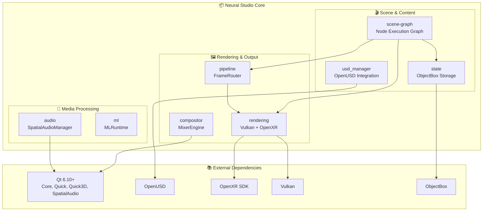

# Neural Studio Core Architecture

This document describes the architecture and organization of the `core/` module.

## Directory Structure

```
core/
├── include/           # Public headers (IPCServer, MixerData, VRHeadsetProfile)
├── lib/               # Library headers (MediaSource, VirtualCamOutput)
├── ml/                # Machine learning runtime (MLRuntime.cpp/h)
├── protocols/         # Communication protocols (VRProtocol)
├── src/               # Main source code
│   ├── audio/         # Spatial audio processing
│   ├── common/        # Shared utilities (IDGenerator)
│   ├── compositor/    # Video mixing engine (MixerEngine, MixerRouter)
│   ├── pipeline/      # Frame routing (FrameRouter, IStitcher)
│   ├── rendering/     # GPU rendering (Vulkan, OpenXR, HDR, RTX)
│   ├── scene-graph/   # Node execution graph & all node types
│   ├── state/         # ObjectBox state management & schemas
│   └── usd_manager/   # OpenUSD stage integration
└── utilities/         # FFmpeg, IPC, media playback helpers
```

## Module Overview

The core module contains the backend engine for Neural Studio, handling rendering, scene management, media processing, and integration with external libraries like OpenUSD and OpenXR.



## Key Components

### scene-graph
The visual node graph engine:
- `NodeExecutionGraph` - Topologically sorted execution of connected nodes
- `NodeFactory` - Creates nodes from type registry
- `BaseNodeBackend` - Base class for all executable nodes
- **Node Types**: Audio, Camera, Effect, Font, HeadsetOutput, Image, LLM, ML, RTXUpscale, Script, Shader, Stitch, Texture, ThreeDModel, Video, WASM

### state
ObjectBox-backed state management:
- `StateStore` - Persistent key-value + graph storage
- **Schemas**: ai/, master/, profile/ - FlatBuffers definitions for nodes, edges, predictions

### rendering
GPU rendering backend:
- `VulkanRenderer` - Qt RHI with Vulkan backend
- `StereoRenderer` - VR stereo output with IPD offset
- `HDRProcessor` - Rec.2020 PQ/HLG tone mapping
- `RTXUpscaler` - NVIDIA AI upscaling (4K→8K)
- `OpenXRRuntime` - VR headset integration

### compositor
Video mixing:
- `MixerEngine` - Combines multiple video streams
- `MixerRouter` - Routes mixer outputs
- `VirtualCamManager` - Virtual camera output

### utilities
Helper libraries (legacy, may migrate to FetchContent):
- `bpm/` - BPM detection
- `ipc-util/` - POSIX pipe IPC
- `media-playback/` - FFmpeg-based playback
- `happy-eyeballs/` - Fast network connection

## Build Configuration

CMake presets are in `CMakePresets.json`. The Ubuntu preset uses:
- Qt 6.10+ from `~/Qt/6.10.1/gcc_64`
- OpenUSD from `~/USD`
- CUDA from `/usr/local/cuda`

See [README_BUILD.md](../README_BUILD.md) for full dependency installation.
