# Neural Studio Core Architecture

This document describes the architecture and dependencies of the `core/` module.

## Module Overview

The core module contains the backend engine for Neural Studio, handling rendering, scene management, media processing, and integration with external libraries like OpenUSD and OpenXR.

```mermaid
graph TD
    subgraph "📦 Neural Studio Core"
        subgraph "🎬 Scene & Content"
            SG["scene-graph<br/>Node Execution Graph"]
            SC["scene<br/>SceneManager"]
            USD["usd_manager<br/>OpenUSD Integration"]
        end

        subgraph "🖼️ Rendering & Output"
            RND["rendering<br/>IRenderEngine + OpenXR"]
            PIPE["pipeline<br/>FrameRouter"]
            COMP["compositor<br/>MixerEngine"]
        end

        subgraph "🎵 Media Processing"
            AUD["audio<br/>SpatialAudioManager"]
            ENC["encoding<br/>Encoder Adapters"]
        end
    end

    subgraph "📚 External Dependencies"
        QT["Qt 6.10.1<br/>Core, Quick, Quick3D"]
        OUSD["OpenUSD 0.26.2"]
        OXR["OpenXR SDK"]
        VK["Vulkan"]
    end

    %% Dependencies
    SG --> SC
    SG --> PIPE
    SG --> RND
    SC --> USD
    USD --> OUSD
    RND --> OXR
    RND --> VK
    PIPE --> RND
    PIPE --> ENC
    COMP --> QT
    SC --> QT
    SG --> QT
    AUD --> QT
```

## Library Dependencies

## Module Details

### scene-graph (`libscene-graph.a`)
The visual node graph engine. Contains:
- `NodeExecutionGraph` - Topologically sorted execution of connected nodes
- `NodeFactory` - Creates nodes from type registry
- `BaseNodeBackend` - Base class for all executable nodes
- **Node Types**: Camera, Video, Image, Audio, 3D Model, Shader, Effect, ML, LLM, Stitch

### scene (`libnstudio-scene.a`)
3D spatial scene management:
- `SceneManager` - Manages scene nodes, transforms, meshes, materials, lights
- `OBJLoader` - Loads OBJ mesh files
- USD stage loading via `UsdStageManager`

### usd_manager (`libneural_studio_usd_manager.a`)
OpenUSD integration:
- `UsdStageManager` - Open/save USD stages, extract prim data
- Converts USD prims to internal scene nodes

### rendering (`libnstudio-rendering.a`)
GPU rendering backend:
- `IRenderEngine` - Abstract render engine interface
- OpenXR runtime for VR headset support
- Vulkan-based rendering (planned)

### pipeline (`libnstudio-pipeline.a`)
Frame routing and composition:
- `FrameRouter` - Routes rendered frames to outputs
- Encoder dispatch
- Virtual camera output

### compositor (`libneural_studio_compositor.a`)
Video mixing:
- `MixerEngine` - Combines multiple video streams
- `MixerRouter` - Routes mixer outputs

### audio (`libneural_studio_audio.a`)
Spatial audio:
- `SpatialAudioManager` - 3D audio positioning

## Data Flow

## Build Status

| Module | Status | Notes |
|--------|--------|-------|
| scene-graph | ✅ | RTXUpscaleNode/HeadsetOutputNode disabled (Qt RHI) |
| scene | ✅ | USD integration working |
| usd_manager | ✅ | C++ only (no Python) |
| rendering | ✅ | OpenXR SDK integrated |
| pipeline | ✅ | - |
| compositor | ✅ | Main executable disabled |
| audio | ✅ | - |

## Configuration

CMake presets are in `CMakePresets.json`. The Ubuntu preset uses:
- Qt 6.10.1 from `~/Qt/6.10.1/gcc_64`
- OpenUSD from `~/USD`
